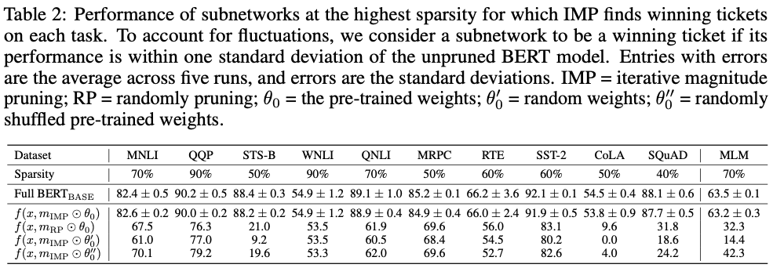
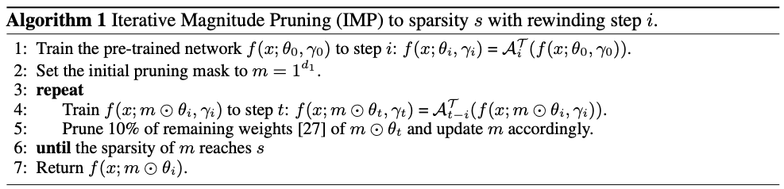

# The Lottery Ticket Hypothesis for Pre-trained BERT Networks

[](https://opensource.org/licenses/MIT)

Code for this paper [The Lottery Ticket Hypothesis for Pre-trained BERT Networks](https://arxiv.org/abs/2007.12223). [NeurIPS 2020]

Tianlong Chen, Jonathan Frankle, Shiyu Chang, Sijia Liu, Yang Zhang, Zhangyang Wang, Michael Carbin.

Our implementation is based on [Huggingface repo](https://github.com/huggingface/transformers). Details are referred to README [here](https://github.com/TAMU-VITA/BERT-Tickets/blob/master/transformers-master/README.md). Pre-trained subnetworks are coming soon.


## Overview

### The Existence of Matching Subnetworks in BERT



### Transfer Learning for BERT Winning Tickets


## Method




## Reproduce Details

### Prerequisites and Installation

Details are referred to README [here](https://github.com/TAMU-VITA/BERT-Tickets/blob/master/transformers-master/README.md).

### Iterative Magnitude Pruning (IMP)

#### MLM task:

```shell
python -u LT_pretrain.py 
	   --output_dir LT_pretrain_model
	   --model_type bert 
	   --model_name_or_path bert-base-uncased 
	   --train_data_file pretrain_data/en.train 
	   --do_train 
	   --eval_data_file pretrain_data/en.valid 
	   --do_eval 
	   --per_gpu_train_batch_size 16 
	   --per_gpu_eval_batch_size 16 
	   --evaluate_during_training 
	   --num_train_epochs 1 
	   --logging_steps 10000 
	   --save_steps 10000 
	   --mlm 
	   --overwrite_output_dir 
	   --seed 57
```

#### Glue task:

```shell
python -u LT_glue.py
	   --output_dir tmp/mnli 
	   --logging_steps 36813 
	   --task_name MNLI 
	   --data_dir glue_data/MNLI 
	   --model_type bert 
	   --model_name_or_path bert-base-uncased 
	   --do_train 
	   --do_eval 
	   --do_lower_case 
	   --max_seq_length 128 
	   --per_gpu_train_batch_size 32 
	   --learning_rate 2e-5 
	   --num_train_epochs 30 
	   --overwrite_output_dir 
	   --evaluate_during_training 
	   --save_steps 36813
	   --eval_all_checkpoints 
	   --seed 57
```

#### SQuAD task:

```shell
python -u squad_trans.py 
	   --output_dir tmp/530/squad 
	   --model_type bert 
	   --model_name_or_path bert-base-uncased 
       --do_train 
       --do_eval 
       --do_lower_case 
       --train_file SQuAD/train-v1.1.json 
       --predict_file SQuAD/dev-v1.1.json 
       --per_gpu_train_batch_size 16 
       --learning_rate 3e-5 
       --num_train_epochs 40 
       --max_seq_length 384 
       --doc_stride 128 
       --evaluate_during_training 
       --eval_all_checkpoints 
       --overwrite_output_dir 
       --logging_steps 22000 
       --save_steps 22000 
       --seed 57
```


### One-shot Magnitude Pruning (OMP)

```shell
python oneshot.py --weight [pre or rand] --model [glue or squad or pretrain] --rate 0.5
```


### Fine-tuning 

#### MLM task:

```shell
python -u pretrain_trans.py 
	   --dir pre\  [using random weight or official pretrain weight]
	   --weight_pertub tmp/shuffle_weight.pt\ [weight for Bert (not required)]
	   --mask_dir tmp/dif_mask/pretrain_mask.pt \ [mask file]
	   --output_dir tmp/530/pre 
	   --model_type bert 
	   --model_name_or_path bert-base-uncased 
	   --train_data_file pretrain_data/en.train 
	   --do_train --eval_data_file pretrain_data/en.valid 
	   --do_eval 
	   --per_gpu_train_batch_size 8 
	   --per_gpu_eval_batch_size 8 
	   --evaluate_during_training 
	   --num_train_epochs 1 
	   --logging_steps 2000 
	   --save_steps 0 
	   --max_steps 20000  
	   --mlm 
	   --overwrite_output_dir 
	   --seed 57
```

#### Glue task:

```shell
python -u glue_trans.py 
       --dir pre \  [using random weight or official pretrain weight]
       --weight_pertub tmp/shuffle_weight.pt \ [weight for Bert (not required)]
       --mask_dir tmp/dif_mask/mnli_mask.pt \ [mask file]
       --output_dir tmp/530/mnli 
       --logging_steps 12271 
       --task_name MNLI 
       --data_dir glue_data/MNLI 
       --model_type bert 
       --model_name_or_path bert-base-uncased 
       --do_train 
       --do_eval 
       --do_lower_case 
       --max_seq_length 128 
       --per_gpu_train_batch_size 32 
       --learning_rate 2e-5 
       --num_train_epochs 3 
       --overwrite_output_dir 
       --evaluate_during_training 
       --save_steps 0 
       --eval_all_checkpoints 
       --seed 5
```

#### SQuAD task:

```shell
python -u squad_trans.py 
	   --dir pre \  [using random weight or official pretrain weight]
	   --weight_pertub tmp/shuffle_weight.pt \ [weight for Bert (not required)]
	   --mask_dir tmp/dif_mask/squad_mask.pt \ [mask file]
	   --output_dir tmp/530/squad 
	   --model_type bert 
	   --model_name_or_path bert-base-uncased 
	   --do_train 
	   --do_eval 
	   --do_lower_case 
	   --train_file SQuAD/train-v1.1.json 
	   --predict_file SQuAD/dev-v1.1.json 
	   --per_gpu_train_batch_size 16 
	   --learning_rate 3e-5 
	   --num_train_epochs 4 
	   --max_seq_length 384 
	   --doc_stride 128 
	   --evaluate_during_training 
	   --eval_all_checkpoints 
	   --overwrite_output_dir 
	   --logging_steps 5500 
	   --save_steps 0 
	   --seed 57
```


### Subnetwork with Ramdomly Suffuled Pre-trined Weight

```
python pertub_weight.py
```


## Citation

If you use this code for your research, please cite our paper:

```
@misc{chen2020lottery,
    title={The Lottery Ticket Hypothesis for Pre-trained BERT Networks},
    author={Tianlong Chen and Jonathan Frankle and Shiyu Chang and Sijia Liu and Yang Zhang and Zhangyang Wang and Michael Carbin},
    year={2020},
    eprint={2007.12223},
    archivePrefix={arXiv},
    primaryClass={cs.LG}
}
```


## Acknowlegement

We would like to express our deepest gratitude to the MIT-IBM Watson AI Lab. In particular, we would like to thank John Cohn for his generous help in providing us with the computing resources necessary to conduct this research.
